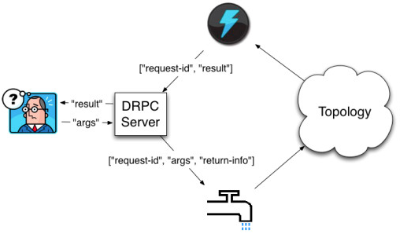
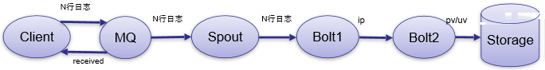

Storm实时低延迟的原因：<br>
- Storm进程是常住内存的，不像Hadoop里面是不断的启停，就没有启停的开销。
- Storm数据是不经过磁盘，都是在内存里，处理完就没有了，数据的交换是通过网络，这就没有了磁盘的IO开销。

Storm和Hadoop的区别：
- 数据来源：Hadoop是HDFS上某个文件夹下的可能是成TB的数据，Storm是实时新增的某一笔数据
- 数据过程：Hadoop是分Map阶段和Reduce阶段，Storm是由用户定义处理流程，流程中可以包含多个步骤，每个步骤可以是数据源(Spout)或处理逻辑(Bolt)
- 是否结束：Hadoop最后是要结束，Storm是没有结束状态
- 处理速度：Hadoop是以处理HDFS上大量数据为目的，Storm是只要处理新增的数据
- 使用场景：Hadoop是要处理一批数据时用的，不讲究时效性，要处理就提交一个JOB，Storm是要处理新增数据时启用的，讲究时效性
- 与MQ对比：Hadoop没有对比性，Storm可以看做是有N个步骤，每个步骤处理完成向下一个MQ发送消息，监听这个MQ的消费者继续处理。

MPI：在写并行分布式程序时，需要很多的显式调用数据传输接口，显式去调用数据同步接口，这样才能把MPI程序显式的RUN。<br>

Storm架构：
- Nimbus <!-- 主节点-->
- Supervisor <!-- 从节点 -->
- Worker <!-- 任务进程 -->

Storm编程模型：
- DAG
- Spout
- Bolt

Strom数据传输：
- Zmq：
1. Zmq是开源的消息传递框架，虽然叫mq，但它不是一个message queue，而是一个封装比较好的消息传输框架。
- Netty：
1. Netty是NIO的网络架构，效率比较高。
2. Zmq的license和Storm的license不兼容的，Bolt处理完消息后会告诉Spout。

Storm高可用性： 
1. 异常处理
2. 消息可靠性保证机制

Storm可维护性：
1. Storm有个UI监控程序。

Storm实时请求应答服务(同步)：
- DRPC
- 实时请求处理
- 
- DRPC Server其适用于分布式，可以应用分布式处理这个单个请求，来加速处理的过程。
- 

Storm实时请求应答服务(异步)：
- 流式处理
- 逐条处理
- 分析统计
- 
```
public static void main(String[] args) throws Exception {
	TopologyBuilder builder = new TopologyBuilder();

	builder.setSpout("spout", new RandomSentenceSpout(), 5); //5个线程

	builder.setBolt("Split", new SplitSentence(), 8).shuffleGrouping("spout"); //8个线程，随机分发

	builder.setBolt("count", new WordCount(), 12).shieldGrouping("split", new Field("word"));//12个线程，按照Field分发

	Config conf = new Config();
	conf.setDebug(true);

	if (args!= null && args.length > 0) {
		conf.setNumWorkers(3);

		StormSubmitter.submitTopologyWithProgressBar(args[0], conf, builder.createTopology());
	}

}
```

|Storm | MapReduce|
|------|----------|
|流式处理|批处理|
|毫秒级|分钟级|
|DAG模型|Map+Reduce模型|
|常驻运行|反复启停|


